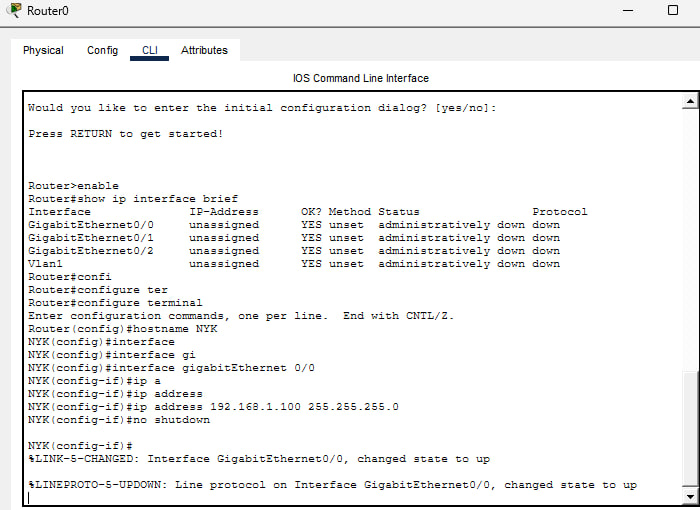
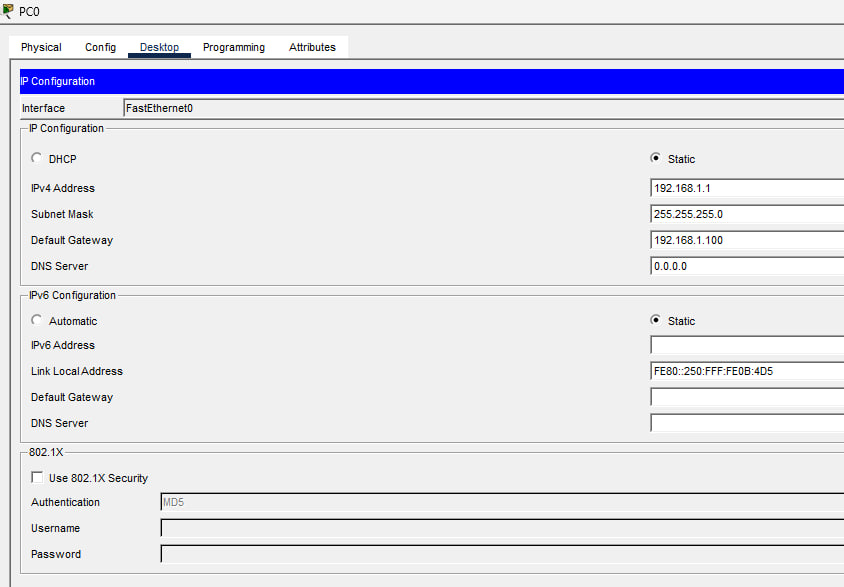
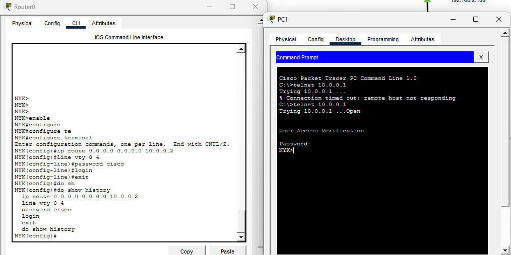
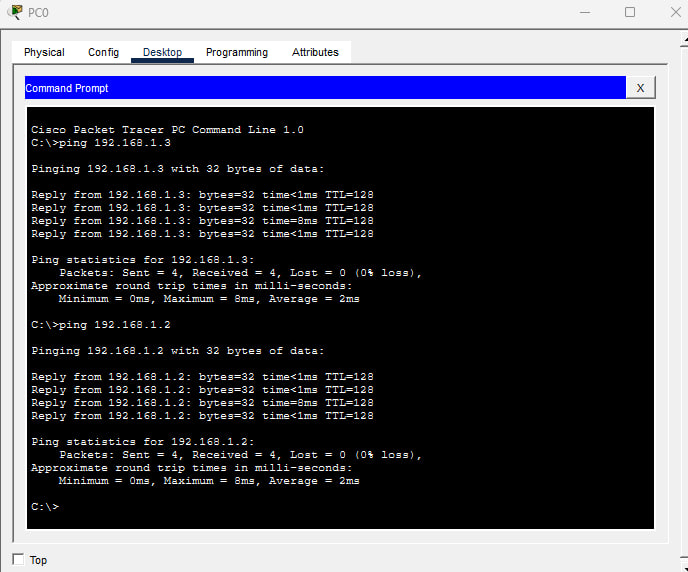
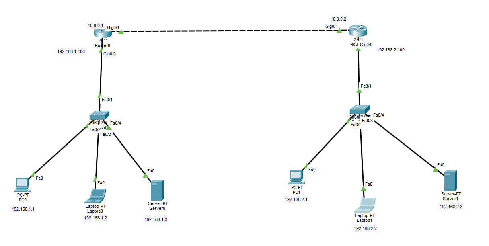
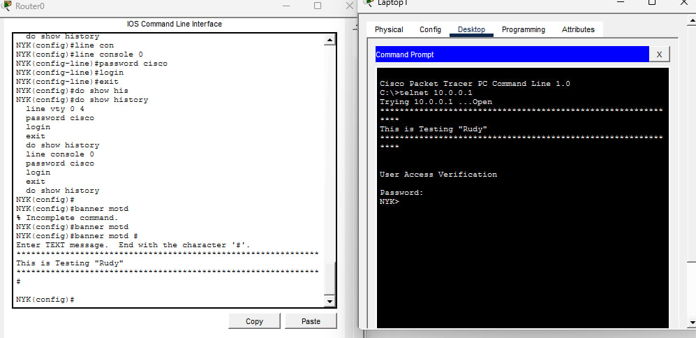
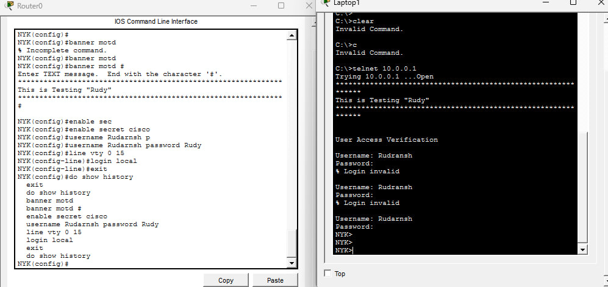

# 🌐 Networking & Cisco Router Configuration Practical

## 📌 Objective

The objective of this practical is to understand fundamental networking concepts and perform basic Cisco router configuration using CLI commands and terminal access.

---

# 🧠 Topics Covered

## 🔹 Networking Fundamentals

* Types of Networks (LAN, MAN, WAN)
* Communication Channels
* IP Addressing
* IPv4 Classification
* Subnetting
* IP Allocation

---

## 🔹 Network Devices

* Router
* Switch
* Hub
* Access Point
* Firewall

---

## 🔹 Network Models

### OSI Model

1. Physical Layer
2. Data Link Layer
3. Network Layer
4. Transport Layer
5. Session Layer
6. Presentation Layer
7. Application Layer

### TCP/IP Model

* Network Access Layer
* Internet Layer
* Transport Layer
* Application Layer

---

# 🛠️ Cisco Router Practical

## 🔹 Cisco CLI Modes

* User EXEC Mode
* Privileged EXEC Mode
* Global Configuration Mode
* Interface Configuration Mode

---

## 🔹 Practical Configurations Performed

* Router initial setup
* CLI navigation
* Interface IP configuration
* Enable password setup
* Interface activation using `no shutdown`
* Connectivity testing

---

# 💻 Example Cisco Commands

## Enter Privileged Mode

```bash
enable
```

## Enter Global Configuration Mode

```bash
configure terminal
```

## Configure Interface

```bash
interface fastethernet0/0
ip address 192.168.1.1 255.255.255.0
no shutdown
```

## Configure Enable Password

```bash
enable password cisco
```

---

# 📸 Practical Screenshots

## Router CLI



---

## IP Address Configuration





---

## Ping 



---

## 



---

## Message of the day Layer



---

## Enable Password Configuration



---

# 📚 Key Learnings

* Understanding network communication
* Working with Cisco CLI
* Configuring routers and interfaces
* Understanding IP addressing and subnetting
* Learning OSI and TCP/IP models

---

# 🔐 Conclusion

This practical provided hands-on experience in networking fundamentals and Cisco router configuration using terminal-based commands and CLI modes.

---

# ⚠️ Disclaimer

This project was created for educational and learning purposes only.
